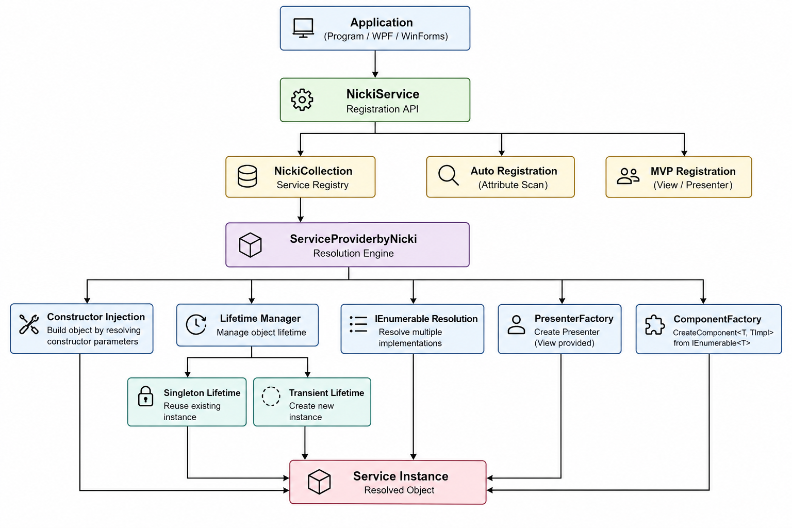

# 自製 DI Container

## 簡介

Nicki DI是一個以學習與實踐為目的所開發的輕量級Dependency Injection容器，實作了.NET DI 的核心概念，包括服務註冊（Service Registration）、依賴解析（Dependency Resolution）、
生命週期管理（Lifetime Management）以及建構式注入（Constructor Injection）。
除了基本的 DI 功能外，也提供Attribute自動註冊、MVP架構整合與Component Factory等擴充能力。

## 架構圖

## ✨ 專案亮點

- 採用 **Reflection** 與 **Constructor Injection** 自行實作輕量級 DI Container，自動完成物件建立與依賴注入。
- 實作 **Recursive Dependency Resolution**，遞迴解析建構子相依鏈並建立完整物件圖（Dependency Graph）。
- 採用 **Attribute-based Auto Registration**，透過 Reflection 自動掃描並註冊服務，降低註冊成本。
- 支援 **`IEnumerable<T>`** 多重服務解析，可同時管理多個介面實作，提升系統擴充性。
- 整合 **MVP 架構**，提供 `PresenterFactory` 與 `ComponentFactory` 封裝元件建立流程，降低 UI 與商業邏輯耦合。
